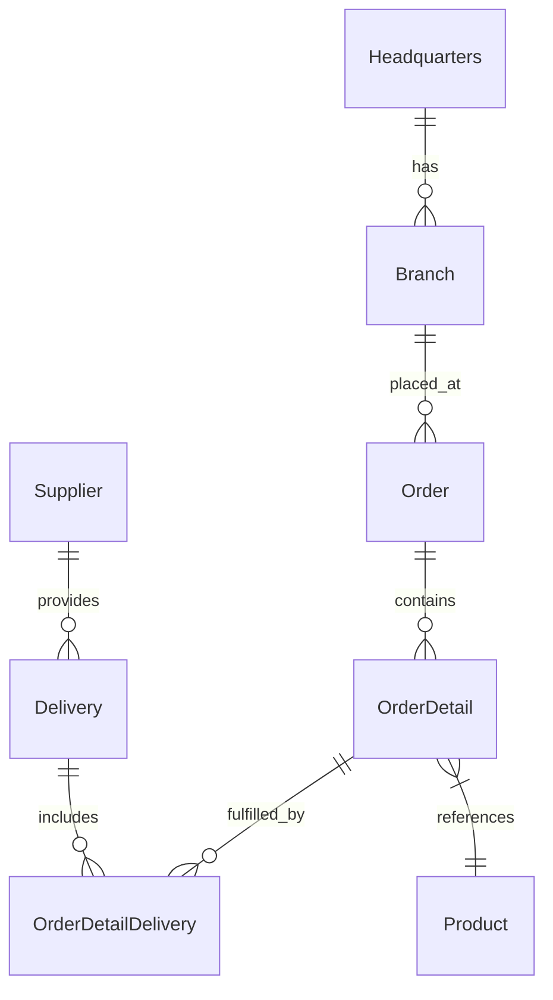

# 🚀 OctoCAT Supply Chain Management


Welcome to the OctoCAT Supply Website - an example website for showcasing the incredible capabilities of GitHub Copilot, and the power of AI-assisted development!

## 🏗️ Architecture

The application is built using modern TypeScript with a clean separation of concerns:



### Tech Stack

- **Frontend**: React 18+, TypeScript, Tailwind CSS, Vite

- **Backend**: Express.js, TypeScript, SQLite, OpenAPI/Swagger

- **Data**: SQLite (file db at `api/data/app.db`; in-memory for tests)
- **DevOps**: Docker

## 🚀 Getting Started

### Prerequisites


- Node.js 18+ and npm

- Make

### Quick Start

1. Clone this repository

2. From VS Code, open a new Git bash terminal and install dependencies:

   ```bash
   make install
   ```

3. Start the development environment:

   ```bash
   make dev
   ```

This will start both the API server (on port 3000) and the frontend development server (on port 5173).

### Available Make Commands

View all available commands:

```bash
make help
```

Key commands:

- `make dev` - Start both API and frontend development servers
- `make dev-api` - Start only the API server
- `make dev-frontend` - Start only the frontend server
- `make build` - Build both API and frontend for production
- `make db-init` - Initialize database schema
- `make db-seed` - Seed database with sample data
- `make test` - Run all tests
- `make clean` - Clean build artifacts and dependencies

### Database Management

Initialize the database explicitly (migrations + seed):

```bash
make db-init
```

Seed data only:

```bash
make db-seed
```


Or use npm scripts directly in the API directory:

```bash
cd api && npm run db:migrate  # Run migrations only
cd api && npm run db:seed     # Seed data only
```
---
## 🤖 Challenges
This project is designed to showcase GitHub Copilot's capabilities. As such, it includes a series of challenges for you to try out:

| Title | Details | Copilot Features |
|-------|---------|------------------|
| [Week 1](/docs/challenges/week1.md) | GitHub Copilot overview | Introduction to GitHub Copilot, and Prompt Engineering |
| [Week 2](/docs/challenges/week2.md) | Use Copilot to build a new feature and improve test coverage | Plan mode, Agent mode, Vision, Prompt Files |

---


